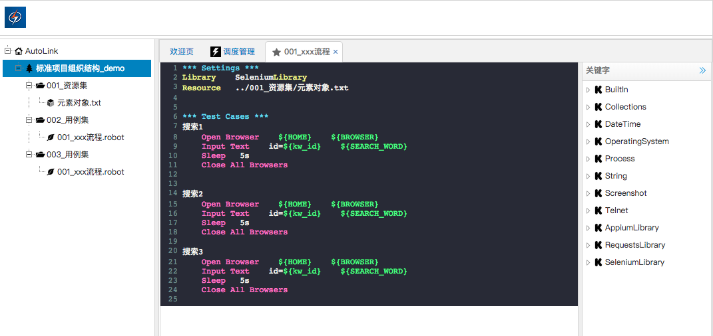

## 介绍

AutoLink开源自动化测试集成解决方案.

- AutoLink是RobotFramework的web集成开发环境.
- AutoLink支持RobotFramework语法高亮，自动提示等功能.
- AutoLink可以帮助你轻易的构建web自动化测试脚本、HTTP接口自动化测试脚本以及移动自动化测试脚本.
- AutoLink完美的支持RobotFramework所有的关键字.
- AutoLink可以直接应用到你的企业实践中，节省框架开发成本.
- AutoLink是很简单的，但也很容易使用.

## 安装与启动

1. 安装Python3版本，确保加入环境变量，pip命令可用

2. 从[AutoLink Github项目](https://github.com/small99/AutoLink)下载源码

3. 执行以下命令安装AutoLink依赖

> pip install -r requirements.txt

4.1 执行以下命令启动AutoLink服务

> python AutoLink.py runserver

4.1.1 访问以下网址，即可

http://127.0.0.1:5000

4.2 执行以下命令可外网访问

> python AutoLink.py runserver -h 0.0.0.0 -p 8000
通过

4.2.1 即可通过你的IP地址来访问

http://ip:8000

注： 
- -h选项指定为0.0.0.0即为绑定本机ip启动，网络其他用户通过你的ip和-p指定的端口即可访问AutoLink

- -p指定AutoLink服务启动时的端口

默认账号: AutoLink
默认密码: 123456

## 苦叶子发起

- 可以关注我的[公众号]，不定期分享开源测试技术

- 加入免费的[读书会]和上千人沟通交流开源测试技术

- 加入付费的[知识星球]与更多的牛人一起交流

- 觉得AutoLink还不错的话，可以打赏一杯咖啡，谢谢

公众号|读书会|知识星球|赞赏码
---|---|---|---
|||

## 截图

AutoLink Web IDE编辑模式截图欣赏

