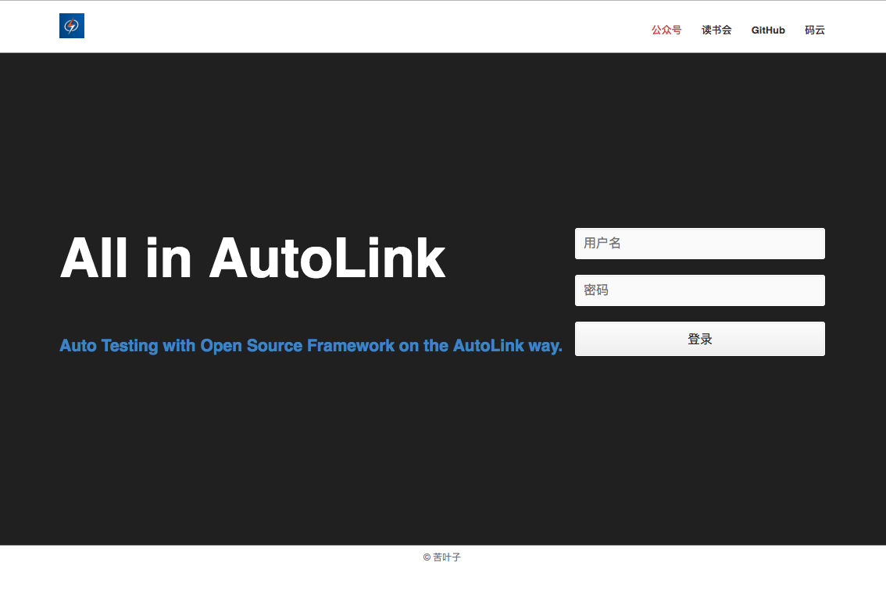
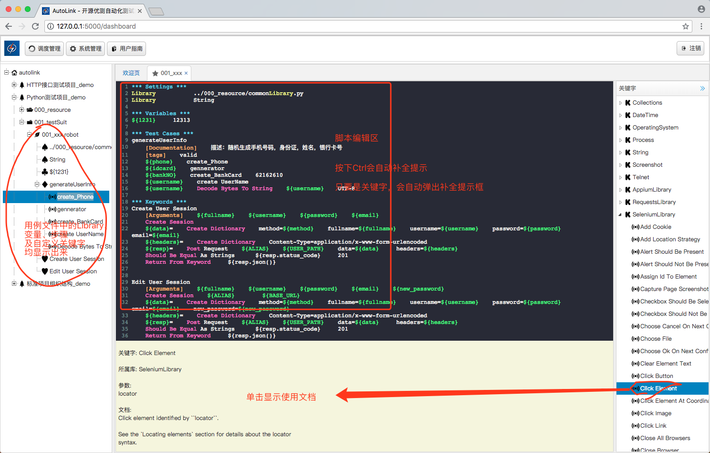
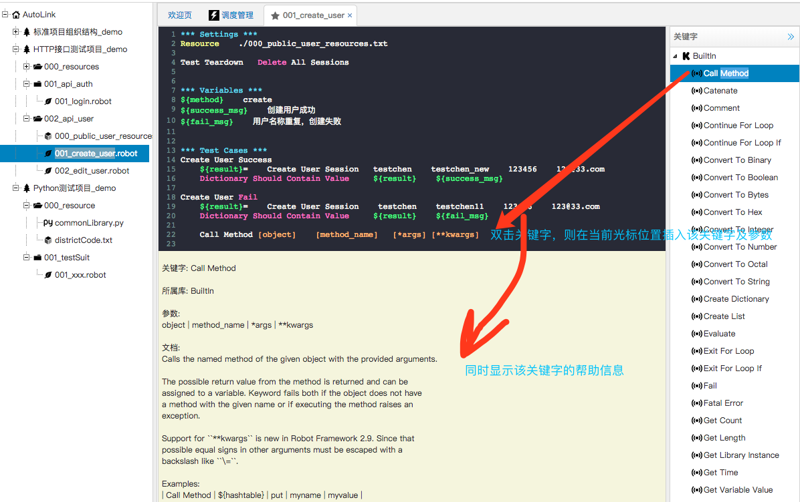

## 介绍

AutoLink开源自动化测试集成解决方案.

- AutoLink是RobotFramework的web集成开发环境.
- AutoLink支持RobotFramework语法高亮，自动提示等功能.
- AutoLink可以帮助你轻易的构建web自动化测试脚本、HTTP接口自动化测试脚本以及移动自动化测试脚本.
- AutoLink完美的支持RobotFramework所有的关键字.
- AutoLink可以直接应用到你的企业实践中，节省框架开发成本.
- AutoLink是很简单的，但也很容易使用.
- AutoLink支持项目级、套件级、用例级运行

## 用户指南

- [简介](./docs/README.md)
- [安装与启动](./docs/安装与启动.md)
- [如何创建测试项目](./docs/如何创建测试项目.md)
- [如何运行测试项目](./docs/如何运行测试项目.md)
- [如何管理用例顺序](./docs/如何管理测试项目中用例顺序.md)
- [使用关键字快捷键](./docs/如何使用自动提示快捷输入关键字.md)
- [关键字概要说明](./docs/关键字概要说明.md)
- [如何使用调度管理](./docs/如何使用调度管理.md)
- [上传和下载RobotFramework用例](./docs/上传和下载RobotFramework用例.md)
- [接口测试示例](./docs/如何创建HTTP接口测试用例.md)
- [Python自定义关键字](./docs/如何调用Python自定义库.md)
- [如何查看关键字详细文档](./docs/如何查看关键字详细文档.md)
- [查看测试报告](./docs/查看测试报告.md)
- [配置SMTP及邮件通知](./docs/配置SMTP服务及邮件通知.md)

## 苦叶子发起

- 可以关注我的[公众号]，不定期分享开源测试技术

- 加入免费的[读书会]和上千人沟通交流开源测试技术

- 加入付费的[知识星球]与更多的牛人一起交流

- 觉得AutoLink还不错的话，可以打赏一杯咖啡，谢谢

公众号|读书会|知识星球|赞赏码
---|---|---|---
|||

## 截图

AutoLink Web IDE编辑模式截图欣赏

邮件通知截图

