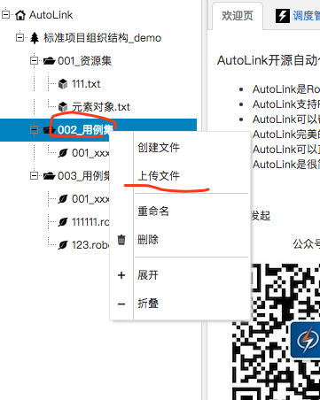
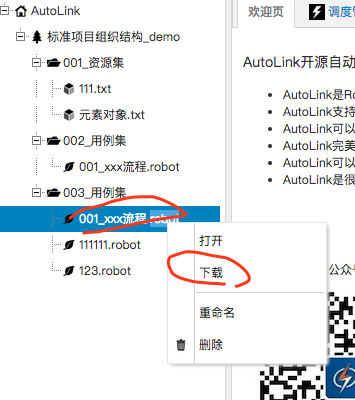

## 简介

在AutoLink中，支持文件的上传和下载功能，具体的操作如下

## 上传文件

在用例层级的节点右击，单击"上传文件"菜单，选择本地的要上传的文件，即可将文件上传，如图：

## 下载文件

选择本地的要上传的文件，即可将文件上传，即可将文件下载到本地硬盘，如图：

## 小结

可以上传任意格式的文件，所以你可以上传图片和python文件等你在写用例过程中用到的各种资源。