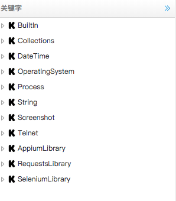

## 简介

AutoLink是基于RobotFramework进行二次开发的，所以其关键字直接继承了RobotFramework所有的关键字，意味着你如果熟悉RobotFramework那么可以使用AutoLink直接进行企业实践

## 分类
下面我们通过一张图看下AutoLink的关键字有哪些分类：

## 说明
下面对各分类进行概要性说明：
- BuiltIn  
提供了系列通用的关键字，不需要导入，可直接使用

以下库，需要导入才能使用，导入方式为

Library xxx

xxx即为下面的库名

- Collections  
提供了处理Python列表和字典的关键字

- DateTime  
提供了日期时间处理能力的关键字

- OperatingSystem  
运行RobotFramework中运行各种与操作系统相关的任务，例如执行批处理、shell等等

- Process  
提供了在系统中运行进程的库，需要RobotFramework2.8及以上版本

- String  
提供了字符串处理的库，例如生成、修改、断言验证

- Screenshot
提供了截图功能的库

- Telnet  
提供了Telnet功能的库

- AppiumLibrary  
提供了移动测试的库，支持android和ios

- RequestsLibrary  
提供了HTTP接口测试的库

- SeleniumLibrary  
提供selenium webdriver强大的web自动化测试的库

注： Selenium2Library官方已经不再维护，改为用SeleniumLibrary库替代了

## 详细文档
各库中关键字详细的使用请参考官方文档：http://robotframework.org/#libraries
