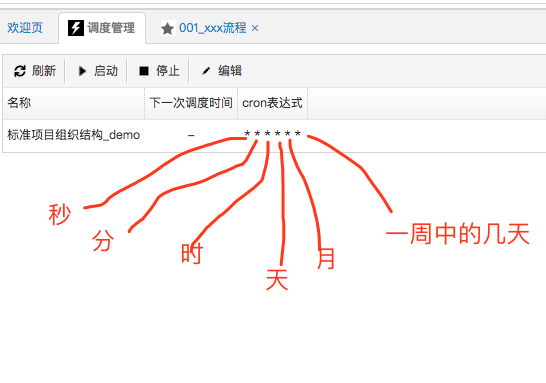
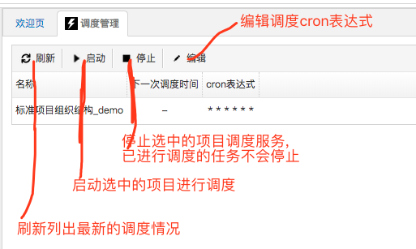
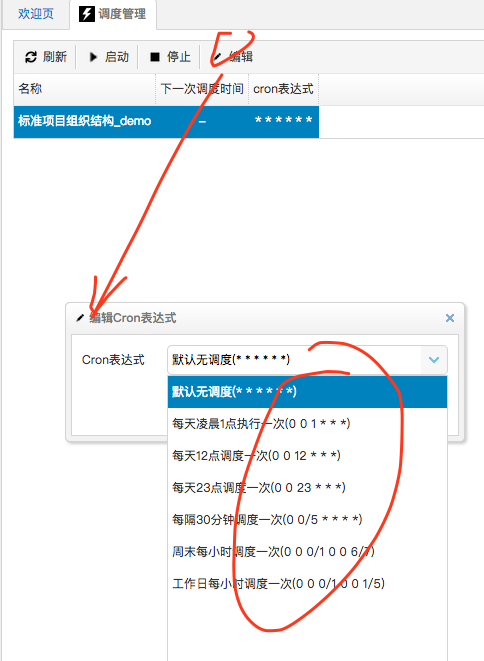

## 简介
在AutoLink中集成了APscheduler作为调度管理器。对APscheduler源码或使用有兴趣的可以参见其官网：https://apscheduler.readthedocs.io/en/latest/userguide.html

在AutoLink中我们主要使用了APscheduler的cron调度风格

下面我们看下在AutoLink中cron表达式各段的含义

## 管理调度

下面我们通过一张图来说明调度管理

## 默认cron表达式

下面我们看下AutoLink默认提供的一些cron表达式

这几种默认的cron表达式，基本可以满足日常需要，当然也可以自己写对应的cron表达式
