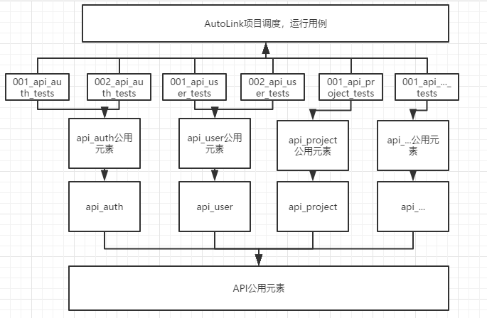

## 如何创建HTTP接口测试用例

### 关于RequestsLibrary
- RequestsLibrary是RobotFramework的第三方库，是基于python的第三方库requests实现的。
因此，RequestsLibrary具有创建连接、采用HTTP方法发送请求、处理响应结果等关键字，用于实现在RobotFramework中编写HTTP接口测试用例。

- [RequestsLibrary的Github源码地址](https://github.com/bulkan/robotframework-requests),源码中的关键字介绍、对应的tests示例，应该会对你编写HTTP接口测试用例有一定启示。
### 采用AutoLink创建HTTP接口测试用例
- 在正式编写用例之前，对用例结构进行规划是必不可少的步骤；
- AutoLink中支持2种格式的文件：```txt```和```robot```，用于实现数据与用例分离；
- Demo示例采用AutoLink的api作为被测接口，采用excel简单梳理了auth和ueser接口的功能，如下:


- Demo示例的组织结构如下：

 

 ### HTTP接口测试用例demo路径

 - [AutoLink_api_tests_demo](../.beats/workspace/AutoLink/AutoLink_api_tests_demo)